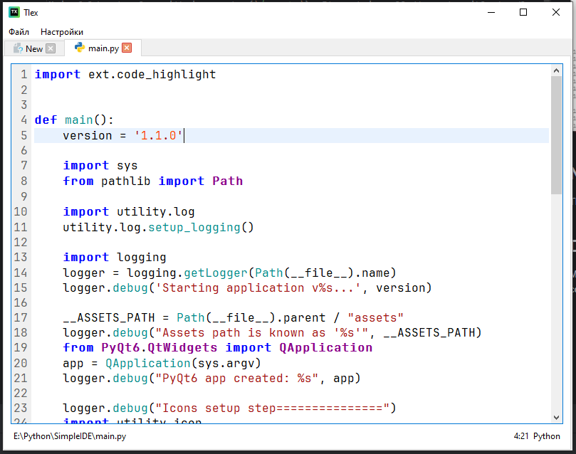

# Tlex - Simple notepad with PyQt6

Version 1.0.1

## Name meaning
Tlex is Text plus Flex (Flexible text editor)

## Description

Main folder to play with is assets (`/assets`). It contains all the extensible handles.

1. Add custom icons to assets (`/assets/icon`)

2. Add custom locale (translation aka internationalization) to assets (`/assets/locale`)

3. Add custom highlighter implementation (_set as python script to provide full extensibility_). Or use prepared class to simplify the goal like:
    ```python
    from ext.code_highlight import RuleBasedHighlighter, HighlighterRegistry
    
    class HelloWorldRBH(RuleBasedHighlighter):
        def __init__(self, parent=None):
            super().__init__(parent)
    
            from ext.code_highlight import HighlightRule
            from PyQt6.QtCore import QRegularExpression
            from PyQt6.QtGui import QTextCharFormat, QColor, QFont
    
            any_format = QTextCharFormat()
            any_format.setForeground(QColor(0, 0, 255))  # Blue
            any_format.setFontWeight(QFont.Weight.Bold)
            self.add_rule(HighlightRule(QRegularExpression(r"Hello World"), any_format))
    
    HighlighterRegistry.get_instance().register(HelloWorldRBH)
    ```

4. Add custom bindings to assets (`/assets/binding`) like:
    ```toml
    suffixes=['.py'] # array of file suffixes
    icon_name='python' # assets icon name
    highlighter_name='PythonRBH' # highligter class name from script
    ```

## Extra

Fonts can be added and used, but its purpose as part of extensibility is not yet defined.

## TODOs
- Code-processors aka Intelli-sense
- Sync english translation with russian
